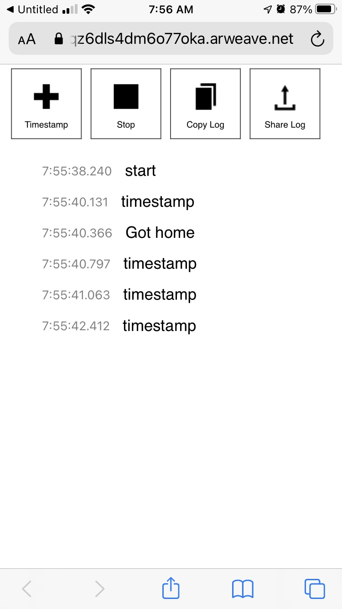

# Timestamp Stopwatch
A simple stopwatch that records timestamps in ISO-8601 format. (Also a technology testbed.)

# Try it
You can run it from [Arweave](https://www.arweave.org/) at address
[WvPobhBKXmoBJAVDABgx4cZWatjZZShnw1y4Nnnf-5Q](https://arweave.net/WvPobhBKXmoBJAVDABgx4cZWatjZZShnw1y4Nnnf-5Q). If you believe Arweave's premise, this should work approximately forever.

If my [Vercel](https://vercel.com/) account is still active, you can also try it at https://timestamp-stopwatch-react.vercel.app/

# What it's for


I first wanted something like this when I was developing the
step-by-step guidance functionality at Citymapper; I wanted to capture
a bunch of annotated timestamps to compare with the logs of the
automatic detection in the other app. At the time, I did find some iOS apps to do
something similar, but the economics of software maintenance
(and the procession of breaking OS changes over time) mean that
the likelihood of that software staying working over time is low.

As I've been investigating decentralized computing and storage systems
like [Arweave](https://www.arweave.org/), I've been curious about
whether they could help provide a more durable platform for small
apps like this one.

So this is a small testbed for hosting a simple web app from Arweave,
as well as a chance for me to experiment a bit with React.

# Deployment
To deploy to Arweave, we first build the React app into a single
HTML file (including images) and launch it in the browser to sanity-check:
```
npm run build && npx gulp && google-chrome build/single/index.html
```

Then, assuming Arweave is set up already locally, we deploy:
```
arweave deploy build/single/index.html
```

# Support
As this is a quick learning project for me,
I don't intend to spend time supporting or improving it except
to try out additional ideas. Nonetheless, I'm happy if you find
some use for it, and you're welcome to take the idea and/or code
and run with it in any direction you want.